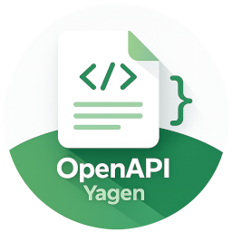

<p align="center">
  
</p>

# Yet another OpenAPI generator (openapi-yagen)

[](https://github.com/openapi-yagen/openapi-yagen/releases/latest)
[](https://github.com/openapi-yagen/openapi-yagen/actions/workflows/build.yml)

Main features:

- a small generator core written in C++
- specific generators are written in JavaScript with support for ES2023 features ([QuickJS](https://bellard.org/quickjs/))
  and [Inja](https://pantor.github.io/inja/) templates (like Jinja)
- extending templates with additional functions defined in JS
- possibility to extend existing generators by overriding some files from a specified directory
- post-processing of output files using custom tools (code formatters, linters, checkers...)
- using generators available via HTTP/S (directly from GitHub, or other sources). The `curl` tool is required.
- understands OpenAPI 3.0, 3.1, 3.2, and Swagger 2.0, converting between them automatically so a
  generator only needs to be written against one 3.x version (see `convert` below, and
  [`generator-format.md`](docs/generator-format.md#spec-versions-and-conversion))

## Installation

Statically-linked binaries for Linux (x86_64) are published on the
[releases page](https://github.com/openapi-yagen/openapi-yagen/releases). Install the latest
release to `/usr/local/bin` with:

```bash
sudo curl -L https://github.com/openapi-yagen/openapi-yagen/releases/latest/download/openapi-yagen -o /usr/local/bin/openapi-yagen && sudo chmod +x /usr/local/bin/openapi-yagen
```

## CLI reference

Supported CLI root options and subcommands:
```
Usage: ./openapi-yagen [OPTIONS] [SUBCOMMAND]

Options:
  -h,--help                   Print this help message and exit
  -v,--version                Print version and exit

Subcommands:
  generate, g                 Generate sources from openapi specification
  convert, c                  Convert an OpenAPI spec from one version to another
  list-generators, l          List built-in generators bundled with this binary (use with -g builtin:<name>)
  extract, e                  Extract a built-in generator's files to a directory, e.g. to customize it further without starting from scratch
  info, i                     Show a generator's metadata: name, description, OpenAPI version, and declared variables
```

### Generate subcommand

```
Generate sources from openapi specification
Usage: ./openapi-yagen generate [OPTIONS] [spec-file]

Positionals:
  spec-file TEXT [openapi.yaml] 
                              Specification file

Options:
  -h,--help                   Print this help message and exit
  --override-dir TEXT         Directory with overridden generator files
  -o,--out-dir TEXT [.]       Output directory for generated code
  -g,--generator TEXT REQUIRED
                              Path to generator. It can be a directory, zip archive, HTTP URL, or a built-in generator (builtin:<name> - see the list-generators command)
  -p,--post-process TEXT ...  Post process file with specified tool for extension
  -c,--clear                  Clear output directory before generating
  -v,--var TEXT ...           Set variable. Syntax is: -v (var_name)=(var_value)
```

#### Post-processing generated files

`-p/--post-process <spec>` runs an external command on each generated file, keyed by extension:

```
-p "ts:prettier --write %file%"
```

`%file%` is replaced with the generated file's path. The `ext1,ext2:` prefix is optional - a
`-p` value with no prefix (just a bare command) runs on *every* generated file, regardless of
extension. Pass `-p` more than once to chain multiple tools (e.g. one for `.kt` files, a different
one for everything else).

### Convert subcommand

```
Convert an OpenAPI spec from one version to another
Usage: ./openapi-yagen convert [OPTIONS] spec-file

Positionals:
  spec-file TEXT REQUIRED     Specification file to convert

Options:
  -h,--help                   Print this help message and exit
  --from TEXT                 Source OpenAPI version (e.g. 2.0, 3.0, 3.1, 3.2) - auto-detected from the spec's own "openapi"/"swagger" field if omitted
  --to TEXT REQUIRED          Target OpenAPI version (e.g. 2.0, 3.0, 3.1, 3.2)
  -o,--out TEXT REQUIRED      Output file path
  --format TEXT               Output format: "yaml" or "json" - inferred from --out's extension if omitted
```

```bash
openapi-yagen convert openapi-3.1.yaml --to 3.0 -o openapi-3.0.yaml
```

### List-generators subcommand

```
List built-in generators bundled with this binary (use with -g builtin:<name>)
Usage: ./openapi-yagen list-generators [OPTIONS]

Options:
  -h,--help                   Print this help message and exit
  -d,--describe               Also print each generator's description
```

### Extract subcommand

```
Extract a built-in generator's files to a directory, e.g. to customize it further without starting from scratch
Usage: ./openapi-yagen extract [OPTIONS] name

Positionals:
  name TEXT REQUIRED          Built-in generator name, with or without a "builtin:" prefix (see the list-generators command)

Options:
  -h,--help                   Print this help message and exit
  -o,--out-dir TEXT REQUIRED  Output directory
```

### Info subcommand

```
Show a generator's metadata: name, description, OpenAPI version, and declared variables
Usage: ./openapi-yagen info [OPTIONS] generator

Positionals:
  generator TEXT REQUIRED     Path to generator. It can be a directory, zip archive, HTTP URL, or a built-in generator (builtin:<name> - see the list-generators command)

Options:
  -h,--help                   Print this help message and exit
```

```bash
openapi-yagen info builtin:kotlin_ktor_client
```

This is the same version conversion `generate` runs automatically when a spec's version doesn't
match a generator's declared `openApiVersion` (see
[`generator-format.md`](docs/generator-format.md#spec-versions-and-conversion)), exposed as a
standalone tool - useful to inspect what a spec looks like in another version, or to pin a spec to
one version before checking it in. It's scoped to the constructs the engine itself models (see the
same doc section) rather than a fully lossless converter for every possible spec field.

The output's top-level keys (`openapi`/`info`/`paths`/... or `swagger`/`info`/`host`/... for a 2.0
target) are written in the specification's own documented order, not alphabetical - nested objects
still come out alphabetical. String values that would otherwise be ambiguous when read back
(a response status code like `200`, or a string that happens to look like a bool/float/null, e.g.
`"true"`/`"1.5"`) are always quoted, so they round-trip as strings rather than being silently
misread as a different YAML type by another tool.

### Examples

#### Running a generator directly from GitHub

`-g` also accepts an HTTP/S URL pointing at a generator's source folder, so you can run a
generator straight from GitHub without cloning it. `openapi-yagen` fetches the generator's files
(`generator.yml`, scripts, templates) over HTTP/S as it needs them, so the URL must point at the
raw folder contents (`curl` is required). For example, using this repo's own
[`sample_cpp_models_generator`](generators/sample_cpp_models_generator/README.md):

```bash
openapi-yagen generate openapi.yaml \
    -g https://raw.githubusercontent.com/openapi-yagen/openapi-yagen/master/generators/sample_cpp_models_generator/src \
    -o out
```

### Using a built-in generator

A handful of the generators in [`generators/`](generators/) are embedded directly into the
`openapi-yagen` binary at build time, so they work offline with no local checkout, zip, or network
access:

```bash
openapi-yagen list-generators
openapi-yagen generate openapi.yaml -g builtin:kotlin_ktor_client -o out -v packageName=com.example.petstore
```

To fork a built-in generator and customize it, extract its files to a directory first:

```bash
openapi-yagen extract kotlin_ktor_client -o my-kotlin-client-generator
```

## Writing a generator

See [`docs/`](docs/README.md) for the full generator-writing documentation: a step-by-step
[tutorial](docs/tutorial.md) building a small generator from scratch, the
[generator format](docs/generator-format.md) (folder layout, `generator.yml`), the
[JavaScript API](docs/javascript-api.md) (globals, built-in functions), and
[templating](docs/templating.md) (Inja syntax, calling functions from templates).

## Generators

Generators are located in the `generators` folder:

- [`sample_cpp_models_generator`](generators/sample_cpp_models_generator/README.md) - minimal
  example generating C++ model structs from schemas.
- [`kotlin_ktor_client_generator`](generators/kotlin_ktor_client_generator/README.md) - Kotlin
  Multiplatform API client for [Ktor](https://ktor.io), engine-agnostic (works on JVM, Android,
  iOS/Native, JS, Wasm).
- [`kotlin_ktor_server_generator`](generators/kotlin_ktor_server_generator/README.md) - Ktor server
  routing + a handler interface you implement, with request validation.
- [`typescript_fetch_client_generator`](generators/typescript_fetch_client_generator/README.md) -
  browser-first TypeScript API client using native `fetch`, zero third-party runtime dependencies,
  works unchanged from any web framework.

## Development

The project is a CMake + Conan 2 C++20 codebase (core in `lib/`, CLI in `cli/`, tests in
`test/`). See [AGENTS.md](https://github.com/openapi-yagen/openapi-yagen/blob/master/AGENTS.md) for build/test commands, project architecture, and coding
conventions - it's the entry point for working on the `openapi-yagen` engine itself (as opposed to
writing a generator, which [`docs/`](docs/README.md) covers).

## TODO

- [x] Add schema validation (structural validation via the typed OpenAPI model itself - no longer
      depends on an external JSON Schema validator)
- [x] Support multiple OpenAPI versions (2.0, 3.0, 3.1, 3.2) with automatic conversion between them
- [x] Add configuration variables
- [x] Improve documentation and add more examples
- [x] Use https://github.com/batterycenter/embed to embed some popular templates into binary
- [x] Add remote templates reading (from GitHub for example)
- [ ] Command to create generator stub
- [x] Command to show available variables for generator
- [x] Restrict access to files outside working folder
- [ ] Post-processing files in batches rather than one at a time
- [ ] Improve documentation (postprocessing, more examples in README)
